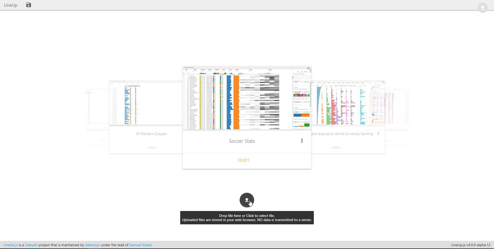
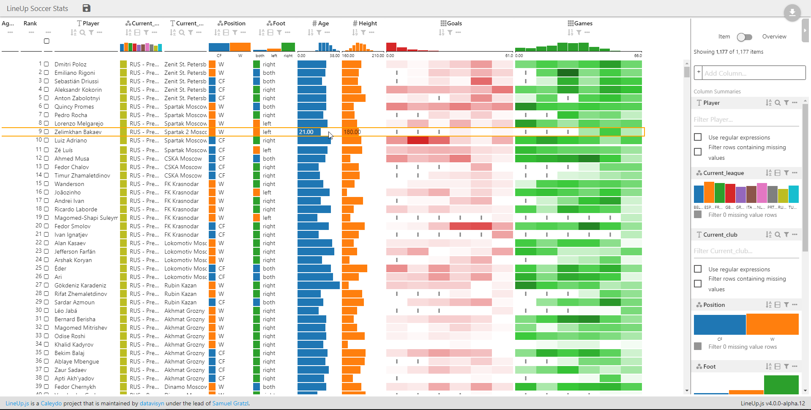
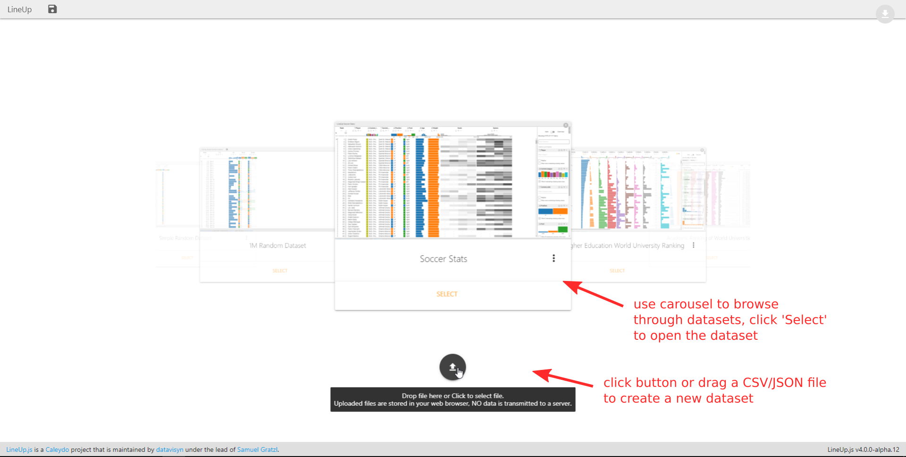
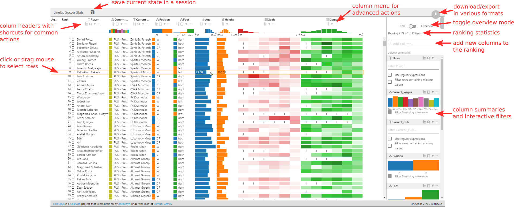

LineUp App
==========

[![License: MIT][mit-image]][mit-url] [![CircleCI][ci-image]][ci-url]  [![CircleCI][ci-image-dev]][ci-url-dev] <sup>(v4)</sup>

LineUp is an interactive technique designed to create, visualize and explore rankings of items based on a set of heterogeneous attributes. 
This is a demo application using [LineUp.js](https://github.com/lineupjs/lineupjs). Details about the LineUp visualization technique can be found at [http://lineup.caleydo.org](http://lineup.caleydo.org). 

The application is deployed at: https://lineup.js.org/app. The develop version using LineUp v4 is deployed at https://lineup.js.org/app_develop. It is a Single Pape Application that requires no server installation. No data is transfered to any server but just kept local in your browser local storage using [IndexedDB](https://developer.mozilla.org/de/docs/Web/API/IndexedDB_API).





Features
--------
 * Data Management
   * Choose one of the preloaded datasets
   * Import/Export CSV File
   * Import/Export JSON File
   * Import/Export LineUp JSON Dump
 * Session Management
   save different analyses with a custom session name. A session represents a view on the current dataset along with the currently specified sorting, filtering, grouping, and so on.
 * Export the current state to one of 
   * https://codepen.io
   * https://jsfiddle.net
   * https://codesandbox.io
 * 

**Note** Uploaded files are stored in your local web browser only.

Supported Browsers
------------------

 * Chrome 64+ (best performance)
 * Firefox 57+
 * Edge 16+


Usage
-----




 

Hosting
-------

This app is a client only app. Thus, requires no server since all data is stored on the browser only. To host it onself: 

1. build the app by following the development environemtn instructions and create a distribution package.
1. copy the content of the `/build` directory to your target destination
1. host the content through a web server such as NGINX or host it by running a local web server. A list of web servers can be found at https://gist.github.com/willurd/5720255. 


Development Environment
-----------------------

**Installation**

```bash
git clone https://github.com/lineupjs/lineup_app.git
cd lineup_app
npm install
```

**Build distribution packages**

```bash
npm run build
```

**Run Linting**

```bash
npm run lint
```


**Serve integrated webserver**

```bash
npm start
```


Authors
-------

 * Samuel Gratzl (@sgratzl)

[mit-image]: https://img.shields.io/badge/License-MIT-yellow.svg
[mit-url]: https://opensource.org/licenses/MIT
[ci-image]: https://circleci.com/gh/lineupjs/lineup_app.svg?style=shield
[ci-url]: https://circleci.com/gh/lineupjs/lineup_app
[ci-image-dev]: https://circleci.com/gh/lineupjs/lineup_app/tree/develop.svg?style=shield
[ci-url-dev]: https://circleci.com/gh/lineupjs/lineup_app/tree/develop
